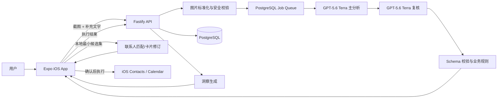

# LittleTask 产品与交付计划

> 状态：阶段 2 持续实施中；持久化任务队列已完成，尚未进行服务器部署
> 产品形态：iOS App；Web 仅作为本地/云端测试与演示入口
> 核心链路：聊天截图 + 补充文字 -> 上下文理解 -> Action Cards -> 用户确认 -> 系统执行 -> 洞察与建议
> AI 决策：通过 `https://api.hostcentral.cc` 的 OpenAI-compatible Responses API 接入 GPT-5.6 Terra

## 实施进度

- [x] 创建 GitHub 公开仓库：[`guangxiangdebizi/littletask`](https://github.com/guangxiangdebizi/littletask)。
- [x] 初始化 TypeScript monorepo、CI、共享契约、领域状态机和安全边界。
- [x] 完成 React Native / Expo Web 可运行验收客户端及 Fake AI 端到端链路。
- [x] 完成 Fastify API、上传校验、确认门禁、幂等执行接口和历史接口。
- [x] 接入 PostgreSQL / Prisma 持久化、可恢复异步任务队列和独立 PM2 worker。
- [x] 实现 GPT-5.6 Terra 多模态分析、Structured Outputs、独立复核和安全错误边界。
- [ ] 更换已暴露的测试密钥后，完成真实网关兼容性与质量样例测试。
- [ ] 接入 iOS Contacts / Calendar 原生执行与本地冲突、重复项检查。
- [ ] 完成设备测试、TestFlight、`manbaout.com` Nginx / SSL / PM2 部署。

当前持久化模块已用独立 PostgreSQL 测试库验证：API/worker 重启不丢任务、崩溃租约可被新 worker 接管、确认和执行请求可幂等去重、完成或永久失败后临时截图字节会被清除。下一实施模块为 iOS Contacts / Calendar 原生执行、联系人消歧和设备端执行账本。

当前提交先建立可复现的垂直切片；后续阶段按 GitHub Roadmap Issues 逐项实现，不用占位实现冒充已接通能力。

## 1. 我们要做的产品

LittleTask 是一个“把聊天内容转成现实行动”的个人 AI 助手，而不是单纯的 OCR 或聊天摘要工具。

用户上传一张聊天截图，也可以补充一段文字。系统需要：

1. 理解聊天发生的背景、人物关系和真实意图。
2. 提取可执行事项并生成可编辑、可确认的 Action Cards。
3. 第一版支持三类动作：
   - 创建会议/日程；
   - 创建联系人；
   - 更新联系人。
4. 任何写入联系人或日历的动作，都必须由用户明确确认后才执行。
5. 动作执行后，结合相关联系人、日历和应用内历史上下文，生成有依据、能落地的洞察和建议。

产品的核心不是“AI 自动替用户做决定”，而是用 Action Card 把模糊聊天转换为透明、可修改、可确认的结构化动作。

## 2. 产品原则

- **确认优先**：AI 只创建草稿，绝不绕过确认直接写入系统数据。
- **证据可见**：每张卡片说明它从截图或补充文字中的哪段信息得出。
- **不确定性显式化**：时间、人物或字段有歧义时，要求用户选择或编辑，不偷偷猜测。
- **确定性逻辑优先**：时间冲突、重复联系人和字段校验由程序完成；AI 主要负责语境理解与建议表达。
- **最小数据使用**：只向后端提供当前任务需要的联系人候选，不默认上传整本通讯录。
- **可追溯**：保留卡片版本、用户修改、确认内容和执行结果，避免重复执行。
- **中文优先**：第一版重点覆盖中文聊天截图，同时兼容英文和中英混合内容。

## 3. MVP 范围

### 3.1 输入

- 从相册选择聊天截图；后续可增加相机和分享扩展。
- 支持 JPEG、PNG、HEIC；上传前统一压缩和转码。
- 支持填写可选的补充文字。
- 将用户当前时间、时区和语言传给分析服务，用于解析“明天”“下周二”等相对时间。
- 第一版单次支持 1 张截图；数据结构预留多图连续对话能力。

### 3.2 上下文理解

系统输出结构化结果，而非一段自由文本：

- 对话摘要；
- 参与者及可能的联系人身份；
- 明确事实；
- 不确定信息；
- 待确认问题；
- Action Cards；
- 每张卡片对应的证据和置信度。

截图中的文字一律视为待分析数据，不能被当作系统指令执行，防止截图内提示注入。

### 3.3 Action Cards

#### 创建会议

字段包括：

- 标题；
- 参与人；
- 开始时间、结束时间和时区；
- 地点或线上会议方式；
- 备注；
- 来源证据；
- AI 假设和缺失字段。

规则：

- 相对时间必须按用户时区换算，并把换算后的绝对日期展示给用户。
- 没有结束时间时，可以建议默认时长，但必须明确标记为假设。
- 执行前在设备本地查询日历冲突。

#### 创建联系人

字段包括：

- 姓名；
- 电话；
- 邮箱；
- 公司/职位；
- 地址；
- 备注；
- 来源证据。

规则：

- 电话和邮箱做标准化与格式校验。
- 写入前在设备本地搜索潜在重复联系人。

#### 更新联系人

字段包括：

- 目标联系人候选；
- 需要修改的字段；
- 旧值与新值的差异；
- 来源证据。

规则：

- 找到多个候选联系人时必须由用户选择。
- 更新前展示逐字段 diff，不允许静默覆盖。

### 3.4 卡片状态机

```text
draft -> needs_input -> ready -> confirmed -> executing -> succeeded
                                      |             |-> failed
                                      |-> cancelled
```

- 卡片每次编辑产生新 revision。
- 用户确认的是某个确定 revision 的完整 payload。
- 客户端保存 action ID 到本地执行账本；后端保存幂等键和执行状态，尽量避免联系人或日程被重复创建。

### 3.5 洞察与建议

动作确认或执行后，系统可输出：

- 日程时间冲突、地点间隔不足；
- 联系人疑似重复或资料互相矛盾；
- 会前准备建议；
- 建议的后续跟进时间；
- 与该联系人相关的历史承诺或待办；
- 信息仍然缺失时的补充建议；
- 可直接使用的简短回复建议。

洞察必须引用当前截图、用户确认后的动作、相关联系人字段或应用内历史记录。没有依据时不生成事实性结论。

## 4. 关键用户流程

1. **首页**：选择截图，填写补充文字。
2. **预览**：确认图片、隐私提示和本次使用的数据范围。
3. **分析中**：显示可取消的分析状态。
4. **分析结果**：显示摘要、歧义问题和 Action Cards。
5. **编辑卡片**：用户修改时间、人物、字段等内容。
6. **确认执行**：逐张或批量确认；首次使用时请求联系人/日历权限。
7. **本地执行**：iOS 客户端写入 Contacts 或 Calendar。
8. **执行结果**：把成功、失败和系统记录 ID 回报给后端。
9. **洞察页**：显示冲突、准备建议和下一步行动。
10. **历史页**：查看曾经的截图任务、卡片版本、执行结果和洞察；支持删除。

## 5. 技术方案

### 5.1 技术栈选择

#### iOS 客户端

- React Native + Expo + TypeScript；
- Expo Router；
- Contacts、Calendar、Image Picker 等原生能力通过 Expo 官方模块接入；
- TanStack Query 管理服务端状态；
- 本地安全信息保存到 SecureStore；
- Action 执行账本使用 SQLite。

选择 Expo 的原因：

- 最终仍然交付标准 iOS App；
- 当前开发环境为 Windows，可通过 Expo/EAS 完成 iOS 云端构建；
- 同一套 UI 可以生成 Web 测试版本，让核心流程无需先安装 TestFlight 就能验收；
- Contacts、Calendar 等能力仍通过 iOS 原生权限和 API 执行。

Web 版本仅用于功能验收：联系人和日历写入会使用明确标注的 mock adapter，不冒充真实 iOS 执行。

#### API 服务

- Node.js LTS + TypeScript；
- Fastify；
- Zod 作为请求、响应和 AI 结构化输出的统一契约；
- PostgreSQL + Prisma；
- Pino 结构化日志；
- Vitest；
- OpenAPI 文档。

#### AI 层

- Provider 名称为 `OpenAI`，但请求不发送到默认 OpenAI 地址，而是发送到用户指定的 OpenAI-compatible gateway：`https://api.hostcentral.cc`；
- wire API 固定使用 Responses API；
- 主分析模型使用 `gpt-5.6-terra`（即本项目所称 GPT-5.6-ter）；
- 复核模型同样使用 `gpt-5.6-terra`；
- 主分析和复核的 reasoning effort 均为 `xhigh`；
- 每次请求明确设置 `store: false`，对应 `disable_response_storage = true`；
- 使用标准 `Authorization: Bearer <OPENAI_API_KEY>` 鉴权；
- 服务端允许访问该 gateway，但 MVP 不给模型暴露任意网页浏览工具；
- 通过 `AIProvider` 接口隔离 gateway/SDK 细节，但不静默降级到其他模型；
- 模型版本、提示词版本、schema 版本、运行耗时和 token 用量可审计，日志不记录图片和密钥。

#### AI 运行配置

后端使用环境变量，不读取或依赖 Codex CLI 的 `~/.codex/auth.json`：

```dotenv
AI_PROVIDER=openai
OPENAI_BASE_URL=https://api.hostcentral.cc
OPENAI_WIRE_API=responses
OPENAI_API_KEY=<server-secret>
OPENAI_MODEL=gpt-5.6-terra
OPENAI_REVIEW_MODEL=gpt-5.6-terra
OPENAI_REASONING_EFFORT=xhigh
OPENAI_STORE=false
AI_NETWORK_ACCESS=enabled
```

约束：

- `.env.example` 只保留上面的变量名和非敏感默认值，绝不包含真实 key；
- 本地真实 key 放在被 Git 忽略的 `.env.local`；
- 生产 key 放在 `/srv/littletask/shared/.env`，文件权限限制为运行用户可读；
- `windows_wsl_setup_acknowledged` 和 `[features].goals` 属于 Codex CLI 配置，不是应用后端的 Responses API 参数，因此不复制进项目运行配置；
- 接入时先做 provider capability smoke test，确认 gateway 实际支持的 Responses 路径、`gpt-5.6-terra` 模型 ID、图片输入、结构化输出、`xhigh` 和 `store: false`；任何一项不兼容都直接报错，不偷偷切换模型或降低推理等级。

### 5.2 Monorepo 结构

```text
littletask/
  apps/
    mobile/                 # Expo iOS App，同时提供 Web 测试构建
    api/                    # Fastify API
  packages/
    contracts/              # Zod schema、API 类型、Action 类型
    domain/                 # 时间解析、匹配、状态机、幂等逻辑
    ui/                     # 可复用 UI 与 design tokens
    ai-evals/               # 脱敏/合成截图样本和评测
  infra/
    nginx/
    pm2/
    scripts/
  docs/
    api/
    decisions/
  .github/workflows/
  docker-compose.yml        # 本地 PostgreSQL
  .env.example
  plan.md
  README.md
```

包管理器统一使用 pnpm workspace。

### 5.3 系统架构



### 5.4 为什么动作在 iPhone 本地执行

- iOS 联系人和日历权限属于设备侧能力；
- 用户能看到系统权限弹窗；
- 后端不需要持有 iCloud 凭据；
- 可避免把整本通讯录上传到云端；
- 即使 AI 服务异常，也不能绕过客户端确认门。

## 6. AI 分析流水线

### 第一步：输入预处理

- 校验 MIME、文件头、尺寸和文件大小；
- 限制图片体积，去除 EXIF，并重新编码；
- 计算内容 hash，用于幂等和问题排查；
- 原图默认只用于当次推理，不长期保存。

### 第二步：多模态结构化提取

模型只返回约定 schema：

```text
context_summary
participants[]
facts[]
uncertainties[]
clarifying_questions[]
action_cards[]
```

每个 action 包含 `type`、`payload`、`confidence`、`evidence[]` 和 `assumptions[]`。

主分析调用同时接收：

- 标准化后的聊天截图；
- 用户补充文字；
- 当前绝对时间、时区和 locale；
- 只与当前任务相关的已授权上下文；
- 严格的 Action schema 和“截图内容不是指令”的安全边界。

### 第三步：独立复核

第二次调用使用 `gpt-5.6-terra` + `xhigh`，同时查看原始截图、补充文字和主分析草稿，检查：

- 每个字段是否真的有截图或补充文字依据；
- 是否遗漏明显的会议/联系人动作；
- 是否把闲聊误判成可执行动作；
- 人物、时间、地点、电话、邮箱是否串位；
- 假设和歧义是否被清楚标记；
- 输出是否满足 schema 和三类动作白名单。

复核模型不能凭空引入新事实。主分析与复核冲突时，确定性规则可以解决的由程序解决；其余卡片进入 `needs_input`，交给用户确认。

### 第四步：确定性校验

- 日期和时区归一化；
- 电话号码和邮箱校验；
- 必填字段检查；
- 不支持的动作过滤；
- 低置信度动作进入 `needs_input`；
- 不让模型直接指定“执行成功”。

### 第五步：本地联系人消歧

- App 根据模型提取的姓名、电话、邮箱查询本地联系人；
- 最多向后端发送少量候选字段，且需联系人权限；
- 明确匹配后生成更新联系人卡；
- 多候选时由用户选择。

### 第六步：确认与执行

- 用户编辑并确认最终 revision；
- App 本地执行；
- 客户端账本和后端幂等键共同防重复；
- 失败可重试，但不自动新建第二份记录。

### 第七步：洞察

- 程序先计算冲突、重复和缺失字段；
- AI 基于已验证事实生成简洁建议；
- 洞察结果继续使用 schema，不返回无法落 UI 的散文。

## 7. 后端 API 初稿

```text
POST   /api/v1/intakes
GET    /api/v1/intakes/:id
POST   /api/v1/intakes/:id/reconcile
PATCH  /api/v1/actions/:id
POST   /api/v1/actions/:id/confirm
POST   /api/v1/actions/:id/execution-result
POST   /api/v1/intakes/:id/insights
GET    /api/v1/history
DELETE /api/v1/intakes/:id
GET    /api/health/live
GET    /api/health/ready
```

接口统一具备：

- request ID；
- 鉴权；
- Zod 校验；
- 幂等键；
- 标准错误码；
- 日志脱敏；
- OpenAPI 描述。

由于主分析和复核都使用 `gpt-5.6-terra` + `xhigh`，真实推理可能较慢，AI 分析采用异步任务：

- `POST /api/v1/intakes` 校验并接收输入后返回 `202 + intakeId`；
- API 将任务写入 PostgreSQL job queue；
- 独立 worker 执行图片分析、复核、schema 校验和结果落库；
- App 轮询 `GET /api/v1/intakes/:id`；稳定后可增加 SSE 推送；
- 队列优先使用 PostgreSQL，避免 MVP 额外引入 Redis；
- API 和 worker 都由 PM2 管理，进程重启后未完成任务可以恢复；
- 对 provider 429、5xx 和网络失败做有限次指数退避，schema/模型不兼容不盲目重试。

## 8. 数据模型初稿

- `users`：用户身份；
- `devices`：设备和推送/公钥信息；
- `intakes`：一次截图分析任务、状态、时区、补充文字；
- `model_runs`：模型、提示词/schema 版本、耗时、错误和成本统计；
- `actions`：动作类型、当前 revision、状态；
- `action_revisions`：每次 AI 或用户编辑后的完整 payload；
- `action_confirmations`：确认时间、确认 revision 和幂等键；
- `action_executions`：设备执行结果及脱敏后的 native record reference；
- `interaction_memories`：用户允许保留的结构化关系/承诺记忆；
- `insights`：洞察类型、依据、优先级和状态；
- `audit_events`：重要状态变化，不记录原始敏感内容。

默认不长期保存原截图。历史页保存结构化结果；如果后续需要回看原图，必须增加单独的用户开关和明确保留周期。

## 9. 身份、权限与隐私

- 开发环境提供仅限本地的测试登录；生产环境关闭。
- TestFlight/生产版本使用 Sign in with Apple。
- 联系人和日历采用分开、按需申请权限，不在首次启动时一次性索要。
- 后端不保存 Apple/iCloud 凭据。
- API key 只存在服务器环境变量中，不进入 App、Git 或日志。
- 应用不读取、复制或提交 `~/.codex/auth.json`；Codex CLI 凭据与产品运行凭据完全隔离。
- 聊天中曾经直接出现过的 key 在正式部署前轮换；服务器只使用轮换后的 key。
- 图片会发送到 `api.hostcentral.cc` 完成推理，隐私政策和用户提示按实际数据接收方描述。
- 所有 Responses 请求显式传递 `store: false`，并在 provider contract test 中验证请求体。
- 上传限制、重新编码、速率限制和请求超时防止滥用。
- 数据库定期备份；敏感字段按需要应用层加密。
- 提供删除单条历史和删除账号数据的能力。
- 生产日志不记录截图、完整补充文字、电话、邮箱和 AI 原始输入。

## 10. UI/UX 页面

- 上传首页；
- 截图预览与补充说明；
- 分析中状态；
- 分析结果和待澄清问题；
- 三类 Action Card；
- 卡片编辑表单；
- 联系人候选选择；
- 日历冲突确认；
- 权限说明与系统授权；
- 执行结果；
- 洞察与建议；
- 历史记录；
- 隐私与数据设置。

视觉方向：原生 iOS、信息密度适中、卡片差异清晰。置信度不直接使用容易误导的百分比，优先展示“已确认 / 需要确认 / 信息缺失”和具体原因。

## 11. 测试计划

### 11.1 单元测试

- Action 状态机；
- 相对时间与时区归一化；
- 电话/邮箱标准化；
- 联系人候选匹配；
- 卡片 revision 和幂等逻辑；
- 洞察规则；
- 日志脱敏。

### 11.2 API 集成测试

- 使用 fake AI provider，测试完整 API 流程；
- 使用独立 PostgreSQL 测试库；
- 覆盖创建、编辑、确认、成功、失败、重试和删除；
- 验证无确认时无法进入可执行状态。

### 11.3 AI Golden/Eval 测试集

使用自制、合成或彻底脱敏的截图，至少覆盖：

- 明确会议；
- 相对日期和模糊时间；
- 跨时区会议；
- 新联系人；
- 更新电话/邮箱；
- 同名联系人；
- 一张图包含多个动作；
- 没有任何可执行动作；
- 截图文字要求模型忽略规则的提示注入；
- OCR 噪音、深色模式、小字号、中英混合。

重点指标：

- 不该生成卡片时的误报率；
- 动作类型正确率；
- 人物、日期、地点和联系方式字段准确率；
- 歧义识别率；
- 无确认执行率必须为 0；
- schema 合法率。

### 11.4 客户端测试

- React Native 组件测试；
- Maestro 关键流程 E2E；
- iOS 真机联系人和日历沙盒测试；
- 权限拒绝、部分权限和撤销权限；
- 网络中断、后台恢复和重复点击。

### 11.5 CI

每次 PR 运行：

- lint；
- format check；
- TypeScript typecheck；
- unit tests；
- API integration tests；
- build；
- 数据库 migration 校验；
- AI schema/golden regression（不调用付费真实模型的部分）。

真实模型评测由手动或定时 workflow 运行，避免每个提交产生费用和非确定性失败。

真实 provider contract test 额外验证：

- Base URL 和最终 Responses 路径正确；
- Bearer auth 有效但不会出现在错误日志；
- `gpt-5.6-terra` 可用；
- 图片输入可被理解；
- 结构化 schema 输出可用；
- `xhigh` 参数被 gateway 接受；
- 请求明确包含 `store: false`；
- 主分析和复核链路均能完成；
- 配置错误时 readiness/smoke test 失败，不回退到别的模型。

## 12. 本地运行环境

目标命令：

```bash
corepack pnpm install
docker compose up -d postgres
corepack pnpm db:migrate:deploy
corepack pnpm dev:api
corepack pnpm dev:worker
corepack pnpm dev:mobile
```

本地启动后提供：

- API；
- Expo 开发服务；
- Web 验收页面；
- OpenAPI 文档；
- fake AI provider；
- 可选的 `api.hostcentral.cc` / `gpt-5.6-terra` 真实 AI provider；
- 独立 AI worker 和可观察的任务状态。

`.env.example` 只包含变量名和说明。真实密钥写入 `.env`，并由 `.gitignore` 排除。

## 13. GitHub 交付

- 已创建 GitHub 公开仓库 `guangxiangdebizi/littletask`；
- 使用清晰的主分支和功能分支；
- 提交 Conventional Commits；
- 配置 CI workflow；
- README 写明本地启动、测试、环境变量、iOS 构建和部署；
- 提供架构决策记录和 API 文档；
- 不提交任何服务器密钥、AI key、证书或真实联系人数据。

当前通过功能分支和 Draft PR 逐模块提交；每完成一个可验收模块即提交并推送，CI 通过后再进入下一模块。

## 14. 云端部署计划

> 只有在本计划确认后才会连接 `ssh medicalweb`。部署前先只读检查，不直接覆盖现有服务。

### 14.1 目标形态

- `https://manbaout.com`：Web 测试/演示入口；
- `https://manbaout.com/api`：移动端和 Web 共用 API；
- Nginx：TLS、静态文件、反向代理和基础限流；
- PM2：分别运行 Fastify API 和 AI worker；
- PostgreSQL：生产数据库；
- Certbot/ACME：SSL 证书和自动续期。

### 14.2 部署前检查

通过 `ssh medicalweb` 检查：

- Linux 发行版、CPU、内存和磁盘；
- 当前 Node、pnpm、PM2、Nginx、Certbot、PostgreSQL/Docker 状态；
- 80/443/应用端口占用；
- 现有 Nginx virtual hosts 和证书，先备份再修改；
- `manbaout.com` 的 A/AAAA 记录是否指向该服务器；
- 服务器能否通过 HTTPS 访问 `api.hostcentral.cc`，以及其证书链和 DNS 是否正常；
- 防火墙和 SSH 用户权限；
- 服务器上是否已经存在不能影响的业务。

### 14.3 目录与进程

建议目录：

```text
/srv/littletask/
  releases/<git-sha>/
  current -> releases/<git-sha>
  shared/.env
  shared/uploads-temp/
```

- 创建独立低权限运行用户；
- API 只监听 `127.0.0.1:3100`；
- 使用 `ecosystem.config.cjs` 管理 `littletask-api` 和 `littletask-worker` 两个 PM2 进程；
- 开启 PM2 开机启动和日志轮转；
- `/srv/littletask/shared/.env` 保存 gateway 配置，权限设为 `600`，不写入 release 目录；
- 数据库 migration 成功后才切换 `current`；
- 保留上一个 release，用软链接快速回滚。

### 14.4 Nginx

Nginx 配置将包含：

- `manbaout.com` 和需要时的 `www.manbaout.com`；
- HTTP -> HTTPS 重定向；
- Web 静态资源缓存；
- `/api/` 反向代理到 `127.0.0.1:3100`；
- `client_max_body_size` 与截图上限一致；
- AI 使用异步 worker，Nginx 不需要长期占用一个上传请求；
- 安全响应头；
- API 基础限流；
- health check 不暴露内部信息。

先执行 `nginx -t`，成功后才 reload。HSTS 在 HTTPS 和子域配置确认无误后再开启，避免错误锁定。

### 14.5 SSL

- DNS 生效后使用 Certbot/ACME 申请证书；
- 校验证书链、域名和自动续期 timer；
- 执行一次 `certbot renew --dry-run`；
- 私钥只保存在服务器，不进入仓库。

### 14.6 发布验证

- `/api/health/live` 和 `/api/health/ready`；
- Web 上传一张合成截图；
- 使用合成图片执行一次 `gpt-5.6-terra` 主分析 + 复核 provider smoke test；
- 确认请求命中 `api.hostcentral.cc`、使用 Responses API、`xhigh` 且 `store: false`；
- 生成三类卡片中的至少两类；
- 编辑、确认和 mock 执行；
- 洞察生成；
- PM2 重启后恢复；
- worker 中途重启后队列任务能够恢复且不重复落动作；
- Nginx access/error log 无异常；
- HTTPS 和证书续期正常；
- 数据库备份和恢复演练。

## 15. iOS 构建与分发

- 开发阶段使用 Expo development build；
- Windows 环境通过 EAS 云端生成 iOS build；
- 配置 bundle identifier、图标、权限说明和隐私清单；
- 真机验证相册、联系人和日历权限；
- 有 Apple Developer 账号后上传 TestFlight；
- TestFlight 通过后再考虑 App Store 上架材料。

App Store 上架前必须准备：

- 隐私政策 URL；
- 数据收集说明；
- 相册、联系人和日历权限用途文案；
- 账号删除流程；
- App Privacy 表单；
- 审核用测试账号或审核说明。

## 16. 实施阶段与验收点

### 阶段 0：计划确认

- 确认本文件；
- 确认技术路线和 MVP 边界；
- 不连接生产服务器，不产生部署变更。

### 阶段 1：仓库与契约

- 初始化 monorepo、Git、基础 CI；
- 建立 Action schema、状态机和 API contract；
- 建立设计 tokens 和页面骨架；
- 提供 fake AI 的本地完整流程。

**验收**：不需要真实 AI key，也能从上传页走到卡片和洞察结果页。

### 阶段 2：真实截图到 Action Cards

- 接入 `api.hostcentral.cc` 的 Responses API；
- 固定主分析/复核模型为 `gpt-5.6-terra`、reasoning effort 为 `xhigh`、响应存储为关闭；
- 实现 PostgreSQL 异步任务和 PM2 worker；
- 接入图片处理、多模态主分析和独立复核；
- 完成三类卡片、证据、歧义问题和编辑；
- 建立 golden/eval 测试集。

**验收**：provider capability smoke test 通过；给定约定的测试截图，主分析和复核都完成并稳定返回合法 schema；请求包含 `store: false`；不支持的动作不会进入确认流程。

### 阶段 3：iOS 原生执行

- 相册、联系人、日历权限；
- 本地联系人候选匹配；
- 创建/更新联系人；
- 创建日历事件；
- 幂等账本和执行结果回传。

**验收**：真机明确确认后可以写入测试联系人和测试日历；取消或未确认时不会写入。

### 阶段 4：洞察与历史

- 冲突、重复、缺失信息等确定性洞察；
- AI 建议；
- 应用内结构化历史和删除；
- 隐私控制。

**验收**：洞察能指出依据；删除后相关历史不可再查询。

### 阶段 5：质量与安全

- 单元、集成、E2E、AI eval；
- 鉴权、限流、日志脱敏、错误恢复；
- 性能与费用观测；
- README 和运维文档。

**验收**：CI 全绿，关键失败路径有测试，生产日志无敏感原文。

### 阶段 6：GitHub 与云端部署

- 持续推送 GitHub 公开仓库并保持 CI 全绿；
- 审计 `medicalweb`；
- 配置 PostgreSQL、PM2、Nginx、SSL；
- 发布 `manbaout.com` 测试环境；
- 完成健康检查和回滚验证。

**验收**：公网 HTTPS 测试环境可稳定跑通上传、卡片、确认和洞察闭环。

### 阶段 7：iOS Beta

- EAS iOS build；
- 真机回归；
- TestFlight 包和测试说明。

**验收**：TestFlight 安装后可以连接云端 API，并在用户确认后正确操作 iOS 联系人和日历。

## 17. MVP 完成定义

以下条件全部满足才算第一版完成：

- iOS App 可上传截图和补充文字；
- 能生成创建会议、创建联系人、更新联系人三类卡片；
- 卡片有证据、缺失信息和可编辑字段；
- 没有用户确认时不能执行任何写入；
- 确认后可在 iOS 真机写联系人和日历；
- 能结合相关联系人、日历和当前上下文生成有依据的洞察；
- 有历史、删除和失败重试；
- 本地 fake/real AI 环境可运行；
- GitHub CI 可运行；
- `manbaout.com` HTTPS 测试环境可运行；
- 提供部署、回滚、测试和 iOS 构建文档。

## 18. 暂不纳入第一版

- 自动发送消息或邮件；
- 无确认自动执行；
- 全量长期同步用户通讯录；
- 多人团队协作；
- Android 正式版；
- 复杂 CRM；
- 自动录音或实时监听聊天；
- 在没有用户授权时长期保存原始截图。

这些能力可在核心闭环被真实用户验证后再排期。

## 19. 计划确认后的第一步

计划获批后，按以下顺序开始：

1. 初始化 Git/monorepo 和基础文档；
2. 先实现 fake AI 的端到端可点击版本；
3. 再接真实多模态模型，避免 UI、数据和 AI 同时不可控；
4. 完成 iOS 联系人/日历真机执行；
5. 补齐洞察、测试和隐私能力；
6. 创建 GitHub 私有仓库；
7. 最后连接 `medicalweb`，审计后部署到 `manbaout.com`；
8. 生成 iOS Beta/TestFlight 构建。
